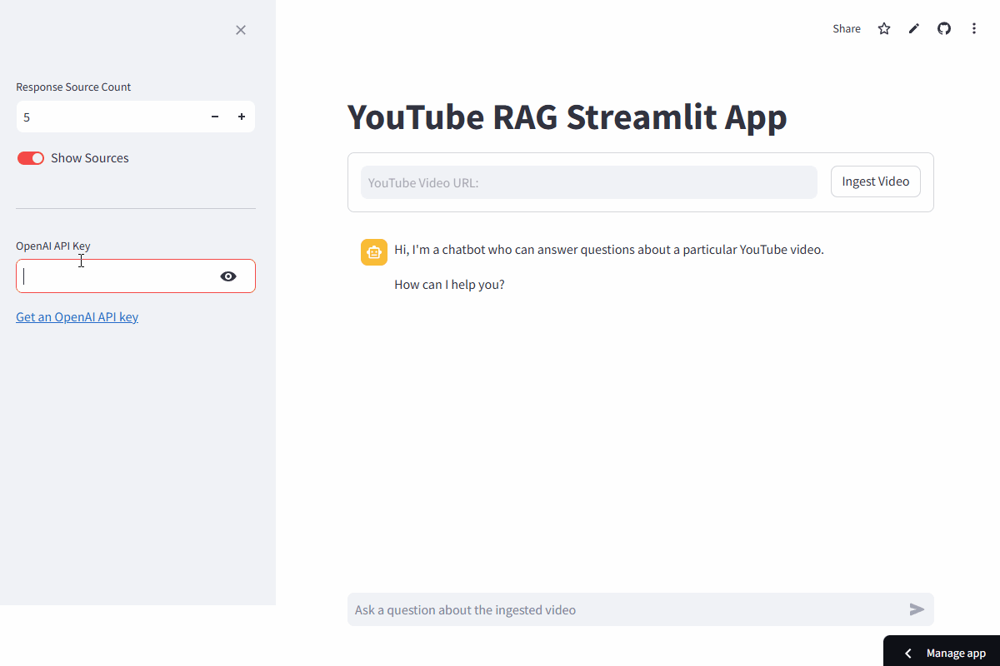

## YouTube Retrieval-Augmented Generation Streamlit App

A Streamlit app that takes a YouTube video URL (eg https://youtu.be/nnTsMXUmzWI), downloads the video transcript, and use the transcript as knowledge base for Retrieval-Augmented Generation.



### To access on streamlit cloud

https://iamfranco-youtube-rag.streamlit.app/

### To run locally

Create a virtual environment `.venv`
```
python -m venv .venv
```

Activate virtual environment `.venv`
```
.venv\Scripts\activate
```

Install requirements from `requirements.txt`
```
pip install -r requirements.txt
```

Start Streamlit App
```
streamlit run app.py
```